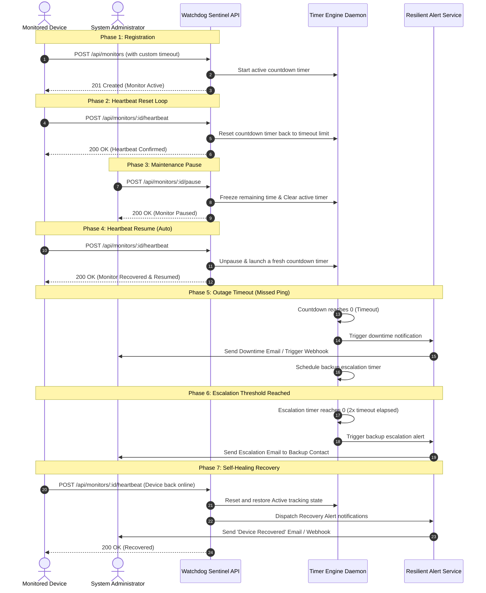
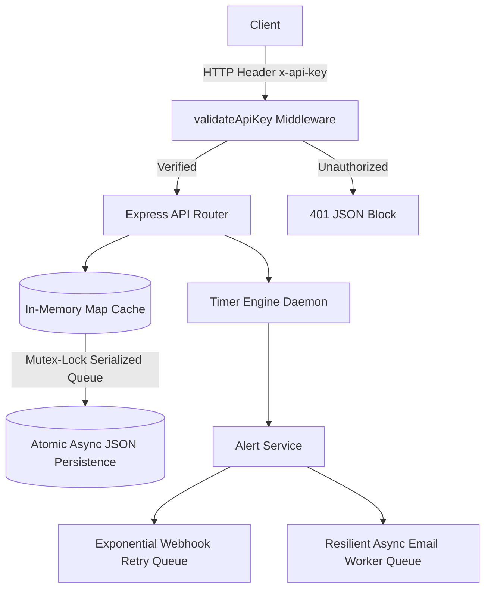

# Pulse-Check-API (Watchdog Sentinel)

A high-reliability Dead Man's Switch API. Devices register a countdown timer. If the device fails to check in before the timer expires, the API triggers down alerts and multi-stage escalations. When a device recovers, it fires self-healing recovery notifications.

All core administrative and operational endpoints are secured via token-based **API Key Authentication**.

---

## 1. Setup Instructions

### Prerequisites
* **Node.js**: v18+ is required (Node native `fetch` is utilized).

### 1. Clone the repository and install dependencies
```bash
git clone https://github.com/JoshNuku/Pulse-Check-API.git
cd Pulse-Check-API
npm install
```

### 2. Configure Environment Variables
Create a `.env` file in the root folder to configure local variables:
```env
PORT=3000
NODE_ENV=development
API_KEY=sentinel-secure-key-2026
ESCALATION_MULTIPLIER=2.0
```

### 3. Run the Server
```bash
# Development mode (auto-reloads on save)
npm run dev

# Production mode
npm start
```

### 4. Testing via Postman
A comprehensive production-grade Postman collection (`Pulse-Check-API.postman_collection.json`) is included in the root folder.
* **API Key Header**: Secure requests automatically attach the `x-api-key: {{apiKey}}` header.
* **Repeated Runs**: Postman pre-request scripts dynamically generate unique device IDs (`device-1779667731...`) to ensure repeat runs do not collide.

---

## 2. Architecture & Flow

### Monitor Lifecycle Diagram



### Secured System Components Flowchart


---

## 3. Added Production Features

Beyond the core requirements, this API is hardened with the following premium features:

* **API Key Authentication Middleware**: Every administrative and operational endpoint is guarded by a global authentication filter validating the `x-api-key` header.
* **Self-Healing Alerts**: When a device recovers from a `down` or `escalated` state back to `active`, the system triggers automatic recovery emails, webhook events (`device_recovered`), and console alerts.
* **Non-Blocking Serialized Atomic Persistence**: Replaced standard blocking synchronous file operations. Writes are made to a `.tmp` file and atomically renamed at the OS level to prevent file corruption. Concurrency writes are managed by a sequential Mutex-like queue to avoid collisions.
* **Outbound Email Worker Retry Logic**: Outbound notification dispatches that encounter transient network or SMTP failures are kept in-queue and retried up to 3 times before being safely discarded.
* **Zero-Loss Reboot Recovery**: On server boot, the system parses stored absolute expiration timestamps. It determines remaining timeout windows or immediately flags devices that went offline while the server was rebooting.
* **Webhook Retry Queue**: Outbound HTTP alerts feature a retry queue utilizing exponential backoff (`2s`, `4s`, `8s`, `16s`) with proper `AbortController` cleanup to avoid event loop memory leaks.

---

## 4. API Endpoints

All endpoints are prefixed with `/api` and require authentication.

| Method | Endpoint | Description | Required Headers |
| :--- | :--- | :--- | :--- |
| `POST` | `/api/monitors` | Registers a new countdown monitor switch. | `Content-Type: application/json`<br>`x-api-key: <key>` |
| `POST` | `/api/monitors/:id/heartbeat` | Pings a heartbeat to reset or resume a monitor. | `x-api-key: <key>` |
| `POST` | `/api/monitors/:id/pause` | Snoozes monitoring for maintenance. | `x-api-key: <key>` |
| `GET` | `/api/monitors` | Lists all monitored devices and their states. | `x-api-key: <key>` |
| `GET` | `/api/monitors/:id` | Retrieves a specific monitor and its remaining time to ping. | `x-api-key: <key>` |
| `GET` | `/` | Public base route (Checks service health status). | *None (Public)* |


### Request Payload Examples

#### Register a Monitor (`POST /api/monitors`)
```json
{
  "id": "solar-inverter-4",
  "timeout": 30,
  "alert_email": "ops-alerts@farm.com",
  "webhook_url": "https://alerts-endpoint.example.com/webhook",
  "backup_email": "engineer-on-duty@farm.com"
}
```

* **Joi Validations**:
  - `id`: Must only contain alphanumeric characters, hyphens, and underscores.
  - `timeout`: Must be a positive integer (seconds).
  - `alert_email`: Must be a valid email format.
  - `backup_email`: Must be a valid email format (optional).
  - `webhook_url`: Must be a valid HTTP/HTTPS URL (optional).
